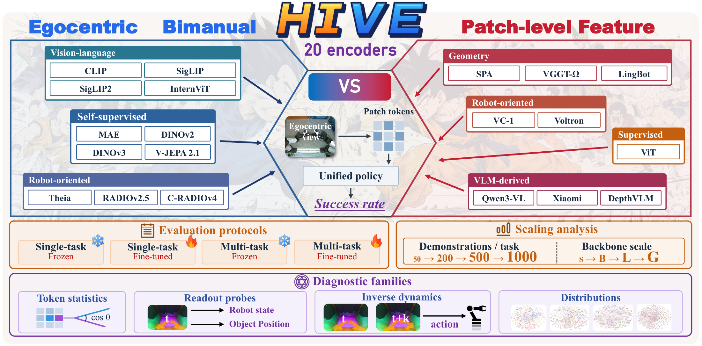

<p align="center">
  
</p>

<p align="center">
  <a href="https://huggingface.co/datasets/zhengtu666/HIVE-Bench-Data"></a>
  <a href="Bench/Robotwin/README.md"></a>
  <a href="Bench/Robocasa_tabletop/README.md"></a>
  <a href="Analyze/README.md"></a>
  <a href="LICENSE"></a>
</p>

<p align="center">
  
  
  
  
  
</p>

<p align="center">
  <b>Evaluating patch-level visual representations for egocentric robot manipulation</b>
</p>

HIVE-Bench compares dense patch tokens from pretrained visual encoders on closed-loop bimanual manipulation. The same flow-matching DiT reads every encoder. Architecture, token interface, data protocol, training recipe, and simulator evaluation stay fixed inside each comparison.

Policies see onboard cameras and receive no proprioception. The study covers frozen and fine-tuned encoders, single-task and multi-task training, and sweeps over data, model size, and VLM layer.

## Findings

Numbers are from the paper. Correlations are Spearman ρ with suite success.

<table>
<tr>
<td width="33%" valign="top">
<br><br>
Mean-pooling each view drops frozen DINOv2 from <b>32.3%</b> to <b>9.9%</b> and DINOv3 from <b>31.2%</b> to <b>6.4%</b> on RoboCasa multi-task. <b>23 of 24</b> task comparisons favor the patch tokens.
</td>
<td width="33%" valign="top">
<br><br>
Inverse-dynamics error tracks success on every frozen vision-encoder cohort (<b>|ρ| ≥ 0.64</b>; −0.82 on RoboTwin) and still does after the VLMs are added. State and object probes do not, once those VLMs join.
</td>
<td width="33%" valign="top">
<br><br>
ImageNet, segmentation, depth, and correspondence scores do not track closed-loop success. A strong perception checkpoint can still drop the action-relevant signal.
</td>
</tr>
<tr>
<td width="33%" valign="top">
<br><br>
All <b>14</b> frozen/fine-tuned pairs improve. On RoboTwin the gains run from 2.2 to 26.1 points; VGGT-Ω goes from <b>50.0%</b> to <b>76.1%</b>. Frozen rank still predicts fine-tuned rank (ρ = 0.96 / 0.89).
</td>
<td width="33%" valign="top">
<br><br>
DINOv2 saturates after Base on RoboCasa. DINOv3 beats DINOv2 on standard vision benchmarks at matched size and trails it on both manipulation suites.
</td>
<td width="33%" valign="top">
<br><br>
Layer 16 gains 6.0–10.7 points on the RoboCasa settings we measured, and changes RoboTwin by less than a point. VLM-derived encoders lead RoboTwin and sit mid-table on RoboCasa.
</td>
</tr>
</table>

## Protocol

The main comparison uses the default checkpoint of each of 20 encoders. Evaluation is 3 seeds × 50 rollouts per task. No proprioception.

| |  |  |
| --- | --- | --- |
| Embodiment | GR1 humanoid, dexterous hands | Dual arm, grippers |
| Tasks | 12 | 12 |
| Demonstrations | up to 1,000 / task | up to 500 / task |
| Cameras | head | head + two wrists |
| Action | 29-D | 14-D joint position |
| Chunk | 16 predicted, 12 executed | 16 predicted, 16 executed |
| Training | single-task and multi-task | multi-task |
| Encoder | all 20 frozen; 7 fine-tuned | all 20 frozen; 7 fine-tuned |

Single-task trains one policy per task. Multi-task trains one language-conditioned policy on all twelve. Fine-tuning on RoboCasa is single-task; on RoboTwin it is multi-task.

## Encoders

<p>

&nbsp; ViT
</p>
<p>

&nbsp; MAE · DINOv2 · DINOv3 · V-JEPA 2.1
</p>
<p>

&nbsp; SPA · VGGT-Ω · LingBot-Vision
</p>
<p>

&nbsp; CLIP · SigLIP · SigLIP2 · InternViT
</p>
<p>

&nbsp; VC-1 · Voltron
</p>
<p>

&nbsp; Theia · RADIOv2.5 · C-RADIOv4
</p>
<p>

&nbsp; Qwen3-VL · DepthVLM · Xiaomi-Robotics-1
</p>

The release also includes other sizes, compatibility aliases, intermediate-layer extraction, and VLM adapters beyond the paper matrix.

<details>
<summary><b>Visual encoder names accepted by DinoGR00T</b></summary>

One canonical name per variant. Aliases still work.

| Family | Names |
| --- | --- |
| DINOv2 | `dinov2_small` `dinov2_base` `dinov2_large` `dinov2_giant` |
| DINOv3 | `dinov3_small` `dinov3_base` `dinov3_large` `dinov3_vith16plus` |
| CLIP / SigLIP | `clip` `siglip` `siglip2` |
| ViT / MAE / SAM | `vit` `mae` `sam3` |
| RADIO | `radio` `cradio_v4_h` `cradio_v4_so400m` |
| Other | `theia` `internvit` `mocov3` `eva` `eva02` |
| Robot | `voltron` `mcr` `lingbot_small` `lingbot_base` `lingbot_large` `lingbot_giant` |
| Geometry | `vggt` `vggt_omega` `vggt_omega_register` `da3` |
| V-JEPA 2.1 | `vjepa2.1_base` `vjepa2.1_large` `vjepa2.1_giant` |
| LeVJEPA | `levjepa_videomix_large` |

Also accepted: `spa_<variant>`, `vc1_base`, `vc1_large`, `distill_theia_<checkpoint>`, supported Hugging Face IDs, and DINOv2 Torch Hub names. LingBot-Vision is a visual encoder, not a VLM.

</details>

<details>
<summary><b>VLM adapters</b></summary>

| Adapter | Name match |
| --- | --- |
| Xiaomi-Robotics-1 | `xiaomi-robotics`, `xiaomirobotics` |
| DepthVLM | `depthvlm` |
| Qwen2.5-VL / Nora | `Qwen2.5-VL`, `nora` |
| Qwen3.5 | `Qwen3.5` |
| Qwen3-VL | `Qwen3-VL` |
| Gemma 3 | `gemma-3`, `gemma3` |
| SmolVLM | `smolvlm`, `smol` |
| OpenVLA | `openvla` |
| Florence-2 | `florence` |
| Cosmos-Reason2 | `cosmos-reason2` |

For probes, `qwen3`, `xiaomi`, and `depthvlm` use the default visual layer. The `_layer16` suffix reads hidden layer 16.

</details>

## Policy

<p align="center">
  
  
  
  
</p>

| Framework | Vision | Language | Head |
| --- | --- | --- | --- |
| `DinoGR00T` | pluggable visual encoder | optional, from the recipe | flow-matching DiT |
| `Dinov3CLIPGR00T` | pluggable visual encoder | frozen CLIP text | fused tokens → DiT |
| `QwenVisionGR00T` | selected VLM layers | frozen CLIP text | projected tokens → DiT |

## Diagnostics

The paper reports 49–51 measurements per cohort. The runner exposes 22 operators (10 single-frame, 10 temporal, 2 sequence-level). Per-view, per-layer, spectral, and probe outputs make up the rest.

| | | |
| --- | --- | --- |
|  | How is information laid out in a frame? | anisotropy, neighbor similarity, effective rank, norm entropy |
|  | How do tokens move along a trajectory? | drift, lag-1 autocorrelation, spectral entropy, frequency bands |
|  | Can robot variables be decoded? | inverse dynamics, forward dynamics, joint state, object position |
|  | Does the policy ignore nuisance change? | texture sensitivity, action robustness, representation shape |

Associations use 100,000-shuffle permutation tests, Benjamini–Hochberg correction within each cohort, and 4,000 bootstrap resamples. Operators, dataset conventions, and launchers are in the [analysis guide](Analyze/README.md).

## Install

<p>
  
  
</p>

Python 3.10 or newer. 3.11 is the version we use.

```bash
git clone https://github.com/KolaKivy/HIVE-Bench.git
cd HIVE-Bench

conda create -n hivebench python=3.11 -y
conda activate hivebench
pip install -r requirements.txt
pip install -e .
```

Weights, datasets, checkpoints, and logs are not in the repo. Point YAML or the shell launchers at a local checkpoint, or pass a Hugging Face model id when the adapter supports it. Code under `third_party/` is part of the release.

RoboTwin and RoboCasa keep their own simulator environments, separate from `hivebench`.

Qwen adapters expect FlashAttention 2:

```bash
pip install flash-attn --no-build-isolation
```

Qwen3.5 needs its own environment with `transformers>=5.2.0`. Extra adapters are integrations. They are not a claim that every model was in the paper, or that one dependency pin serves all of them.

## Guides

Run commands from the repository root.

<table>
<tr>
<td width="33%" align="center" valign="top">
<a href="Bench/Robotwin/README.md"></a><br><br>
download, convert, train, serve, evaluate
</td>
<td width="33%" align="center" valign="top">
<a href="Bench/Robocasa_tabletop/README.md"></a><br><br>
download, train, serve, evaluate
</td>
<td width="33%" align="center" valign="top">
<a href="Analyze/README.md"></a><br><br>
probes, token metrics, robustness, figures
</td>
</tr>
</table>

RoboTwin demonstrations:

```bash
pip install -U huggingface_hub
hf download zhengtu666/HIVE-Bench-Data --repo-type dataset \
  --include "RoboTwin_data/**" --local-dir playground/Datasets
```

## Layout

```text
Policy/hivebench/     models, dataloaders, training, configs
Policy/deployment/    policy server
Bench/Robotwin/       RoboTwin workflow
Bench/Robocasa_tabletop/
Analyze/              diagnostics and probes
third_party/          bundled research code
```

A new visual encoder implements the token interface used by `DinoGR00T`. A new VLM exposes visual-token extraction through the shared adapter. A new diagnostic plugs into the analysis runner.

## Citation

```bibtex
@article{liang2026hivebench,
  title   = {HIVE-Bench: Evaluating Patch-Level Visual Representations for Egocentric Robot Manipulation},
  author  = {Liang, Qiwei and Liang, Zhengtu and Lai, Minghao and Chen, Yikeng and Wang, Yiming and Cai, Boyang and Fang, Yuetong and Wang, Taowen and Yin, Baiqiao and Chen, Tianxing and Chen, Yue and Liang, Jiaming and Chen, Guangyu and Zhu, Shaolong and Zhang, Shanghang and Ma, Daolin and Xu, Renjing},
  year    = {2026}
}
```

The arXiv link will replace this note once the paper is public. License: [MIT](LICENSE). Keep the notices on bundled third-party code.
